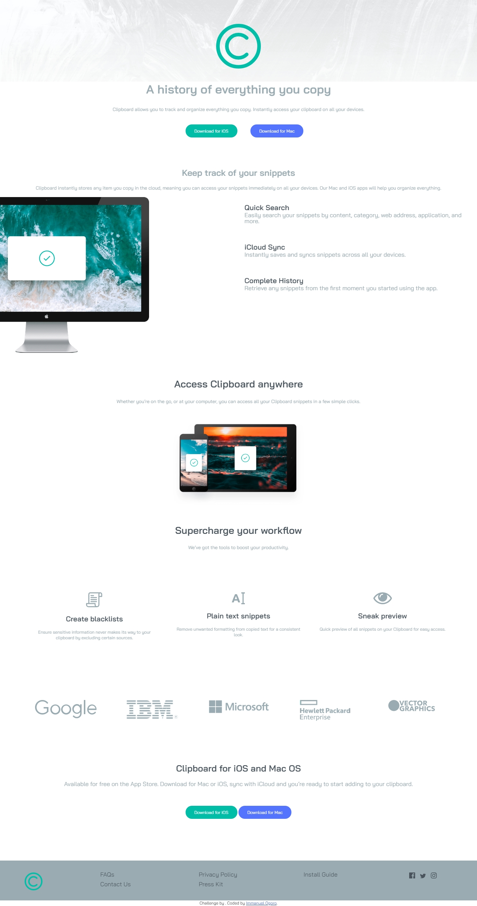

# Frontend Mentor - Clipboard landing page solution

This is a solution to the
[Clipboard landing page challenge on Frontend Mentor](https://www.frontendmentor.io/challenges/clipboard-landing-page-5cc9bccd6c4c91111378ecb9).
Frontend Mentor challenges help you improve your coding skills by building realistic projects.

## Table of contents

- [Overview](#overview)
  - [The challenge](#the-challenge)
  - [Screenshot](#screenshot)
  - [Links](#links)
- [My process](#my-process)
  - [Built with](#built-with)
  - [What I learned](#what-i-learned)
  - [Continued development](#continued-development)
  - [Useful resources](#useful-resources)
- [Author](#author)
- [Acknowledgments](#acknowledgments)

**Note: Delete this note and update the table of contents based on what sections you keep.**

## Overview

### The challenge

Users should be able to:

- View the optimal layout for the site depending on their device's screen size
- See hover states for all interactive elements on the page

### Screenshot

### Links

- Solution URL: [Add solution URL here](https://your-solution-url.com)
- Live Site URL: [Add live site URL here](https://your-live-site-url.com)

## My process

### Built with

- Semantic HTML5 markup
- CSS custom properties
- Flexbox
- CSS Grid
- Mobile-first workflow

### What I learned

I learnt how to design a responsive website ,how to make my code readable also how to use responsive fonts ,also
overflow hidden(Also got to pratice with positioning),i also added some animations as required by the active states file
on the footer links and the buttons and added some extras to the company logos like google ibm etc...(they were quite
cool init 😂)

### Continued development

### seful-resources

1)[link:https://www.rapidtables.com/convert/color/hsl-to-rgb.html]this helped me convert the colors from hsl to rgb
color format when implementing the hover states for the buttons

## Author

- Frontend Mentor - [@yourusername](https://www.frontendmentor.io/profile/yourusername)
